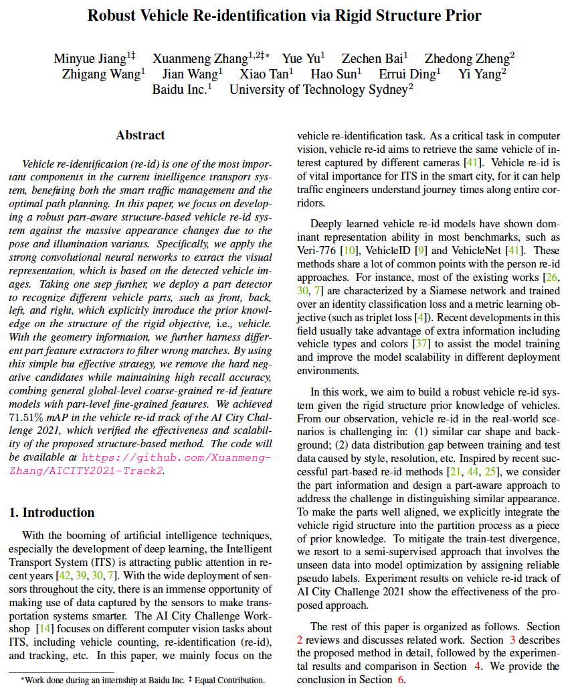

# AICITY2021-Track2

In this repo, we include the runner-up solution of AICITY Challenge Track2 (Vehicle Re-Identification)  at CVPR 2021 Workshop.

<!-- > This repository is an official PyTorch implementation of paper:<br> -->
> [Robust Vehicle Re-identification via Rigid Structure Prior](https://openaccess.thecvf.com/content/CVPR2021W/AICity/papers/Jiang_Robust_Vehicle_Re-Identification_via_Rigid_Structure_Prior_CVPRW_2021_paper.pdf)<br>
> Minyue Jiang\*, Xuanmeng Zhang\*, Yue Yu, Zechen Bai, Zhedong Zheng,Zhigang Wang, Jian Wang, Xiao Tan, Hao Sun, Errui Ding, Yi Yang <br>
> \* denotes equal contribution.

<!-- [[Download PDF]](https://openaccess.thecvf.com/content/CVPR2021W/AICity/papers/Jiang_Robust_Vehicle_Re-Identification_via_Rigid_Structure_Prior_CVPRW_2021_paper.pdf) -->

<!--  -->

## Overview

The repo contains the training code, testing code and additional annotations on the training sets.

```bash
├── AICITY2021-Track2/
│   ├── annotations/
│   ├── global-aware-model/
│   ├── part-aware-model/
│   ├── post-processing/
```
## Getting Started

### Prerequisite

1. Download the pre-trained model.
   - [ResNet101-ibn](https://github.com/XingangPan/IBN-Net/releases/download/v1.0/resnet101_ibn_a-59ea0ac6.pth)
   - [Se_ResNet101-ibn](https://github.com/XingangPan/IBN-Net/releases/download/v1.0/se_resnet101_ibn_a-fabed4e2.pth)
   - [ResNeSt-101](https://s3.us-west-1.wasabisys.com/resnest/torch/resnest101-22405ba7.pth)
   - [HRNet-48](https://paddle-imagenet-models-name.bj.bcebos.com/HRNet_W48_C_ssld_pretrained.tar)
   - [Res2Net-200](https://paddle-imagenet-models-name.bj.bcebos.com/Res2Net200_vd_26w_4s_ssld_pretrained.tar)
2. Download the  AICity2021 dataset.
3. Prepare the dataset. See [prepare data](https://github.com/PaddlePaddle/Research/tree/master/CV/PaddleReid/process_aicity_data) .


### Annotations

We select images from the training set of CityFlowV2 to annotate the defined bounding box and the direction in [annotations](annotations).

### Training

1. Follow [reid model](global-aware-model/TRAIN.md)  to train the reid models.
2. Follow [detection model](part-aware-model/ppdet/README.md)  to train the detection models.
3. Follow [direction model](part-aware-model/vreid_direction/README.md)  to train the direction classification models.

### Testing

1. Follow [reid model](global-aware-model/TEST.md)  to extract the reid features.
2. Follow [detection model](part-aware-model/ppdet/README.md)  to inference on query and test datasets.
3. Follow [direction model](part-aware-model/vreid_direction/README.md) to inference on query and test datasets.

### Post-processing

Follow [post-processing](post-processing/run.sh) to get the final result.

## Performance
AICITY2020 Challange Track2 Leaderboard
||TeamName|mAP|Link|
|---|--------|----|-------|
|1|Alibaba|0.7445|[code](https://github.com/michuanhaohao/AICITY2021_Track2_DMT)|
|2|**Baidu UTS**|0.7151|[code](https://github.com/Xuanmeng-Zhang/AICITY2021-Track2)|
|3|CyberHu|0.6550|code|

## Acknowledgment

Our implementation is partly based on the following codebases. We gratefully thank the authors for their wonderful works: 
[fast-reid](https://github.com/JDAI-CV/fast-reid),
[PaddleReid]( https://github.com/PaddlePaddle/Research/tree/master/CV/PaddleReid ), and [AICIty-reID-2020]( https://github.com/layumi/AICIty-reID-2020 ).
## Citation

If you find our work useful in your research, please consider citing:
```bibtex
@inproceedings{jiang2021robust,
  author    = {Jiang, Minyue and Zhang, Xuanmeng and Yu, Yue and Bai, Zechen and Zheng, Zhedong and Wang, Zhigang and Wang, Jian and Tan, Xiao and Sun, Hao and Ding, Errui and Yang, Yi},
    title     = {Robust Vehicle Re-Identification via Rigid Structure Prior},
    booktitle = {Proceedings of the IEEE/CVF Conference on Computer Vision and Pattern Recognition (CVPR) Workshops},
    month     = {June},
    year      = {2021},
    pages     = {4026-4033}
}
```
